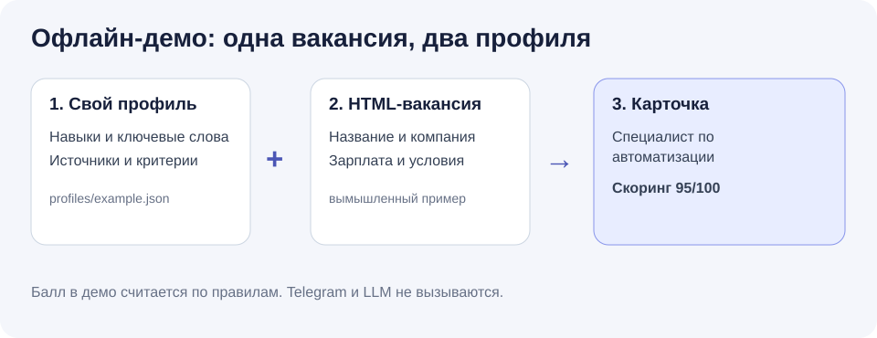

# Каркас бота для подбора вакансий

Задайте свой профиль и правила отбора в JSON, затем получите карточки вакансий. Код не содержит профиля владельца, его аккаунтов и токенов. Пример ниже полностью вымышленный.



**Быстрый запуск** (Python 3.11 или новее):

```powershell
python -m venv .venv
.venv\Scripts\python -m pip install -e .
.venv\Scripts\python -m remotejob_bot --demo --profile ai_automation
```

На macOS/Linux во второй и третьей строках используйте `.venv/bin/python`.
После установки `--demo` работает из любой папки: вымышленные HTML-страницы и профиль включены в Python-пакет.

## Что умеет этот каркас

| Режим | Что происходит |
| --- | --- |
| `--demo` | Три вымышленные HTML-страницы проходят через настоящий парсер и ваш профиль. Сеть, Telegram и токены не нужны. Балл рассчитывается по ключевым словам. |
| `run-once --html` | Читает сохранённую HTML-страницу вакансии в формате `remote-job.ru` и показывает карточку после фильтров. Запросов в сеть нет. |
| `run-once --search-url` | Один раз открывает указанную страницу поиска на `remote-job.ru`, читает не более 3 найденных вакансий и показывает карточки. Структура сайта может измениться. |
| `run-once ... --telegram` | Отправляет полученные карточки в ваш чат через Telegram Bot API. Отправка происходит только с этим флагом. |

## Сайты вакансий и Deep Research

**Сейчас в открытом каркасе** есть один парсер вакансий — для `remote-job.ru`. Команда `run-once --search-url` принимает адреса поиска только на этом сайте. Просто указать в профиле URL другого сайта пока нельзя: `enabled_sources` поддерживает только `remotejob`. В исходном частном приложении есть код для пяти площадок: `remote-job.ru`, `hh.ru`, Habr Career, `designer.ru` и `HireHi.ru`; сюда эти дополнительные парсеры не перенесены. Их текущую работу на живых сайтах при подготовке каркаса не проверяли.

Чтобы добавить другой сайт, например `hh.ru`, Habr Career или `designer.ru`, напишите под него отдельный адаптер. Он должен получить вакансии и привести их к общему формату `RawVacancy`; интерфейс `VacancySource` уже описан в `models.py`. Затем зарегистрируйте источник в `search_profiles/registry.py`, подключите его в `run_once.py` и добавьте тест с примером страницы или ответа API. Структура сайтов меняется, поэтому новый адаптер нужно проверять на выбранном источнике.

**Deep Research** в исходном приватном RemoteJob имеет пять режимов запроса (`general`, `job`, `skills`, `vibe`, `vacancy`) и реализации пяти поисковых провайдеров: Exa, Tavily, Brave Search, SerpAPI и DuckDuckGo Instant Answer. Они ищут материалы по запросу для исследовательского отчёта. Команда `/research` и эти провайдеры в данный открытый каркас не включены. Если добавляете их в свою версию, настройте каждого провайдера отдельно; нужные API-ключи храните в игнорируемом `.env`.

LLM в этой версии **не подключён**. Балл прозрачен: совпадение ключевых слов и признак удалённой работы. Место для собственной модели находится в `pipeline.evaluate`; парсер и доставка вынесены отдельно. Это основа для своего бота, а не готовый сервис непрерывного мониторинга.

## Подключение своей нейросети

Каркас не привязан к конкретной нейросети. Чтобы использовать свою модель, добавьте **адаптер под свои задачи и её API**: небольшой модуль, который передаёт вакансии модели и возвращает результат для оценки. Подключить его можно в `pipeline.py` / `run_once.py`. Вы сами решаете, какие данные адаптер отправляет внешнему сервису.

Ключ выбранного сервиса храните в `.env`: скопируйте `.env.example` в `.env` и заполните `AI_API_KEY`. Файл `.env` исключён из Git. Адаптер должен загрузить этот файл (например, через `python-dotenv`) и прочитать ключ из окружения. Адрес API, формат запроса и название модели настройте под выбранный сервис.

**Сейчас одного ключа недостаточно:** готового LLM-адаптера нет, `AI_API_KEY` основным кодом не читается, а `--demo` и `run-once` продолжают работать по прозрачным правилам. Не вписывайте ключ в JSON-профиль или исходный код.

## Настройте под себя

1. Скопируйте `profiles/example.json` в `profiles/local.json`. Файл `local.json` игнорируется Git.
2. Замените вымышленные `profile_text`, `heuristic_keywords`, название и ключ профиля своими. В `enabled_sources` пока поддержан запуск `remotejob`; другие названия зарезервированы для будущих адаптеров.
3. Для поиска вставьте адрес страницы результатов `remote-job.ru` в `remotejob_search_urls`. Для локальной HTML-страницы этот список можно оставить пустым.

Текущий профиль выбирается `--profile`. Порог балла задаётся `--min-score`, минимальная предложенная зарплата через `--min-salary`, требование удалёнки через `--remote-only`. При заданном `--min-salary` вакансия проходит только если известная нижняя граница зарплаты не меньше порога; вакансия только с верхней границей или без зарплаты исключается. Поле `presentation_policy` позволяет записать собственные правила подачи опыта. Оно и поля `eval_context`, `pipeline_context`, `resume_context`, `digest_context` предназначены для будущего LLM-адаптера. **В этой версии они не применяются:** скоринг использует только ключевые слова, зарплату и признак удалёнки; черновики откликов не создаются.

```powershell
.venv\Scripts\python -m remotejob_bot run-once --html fixtures/automation.html --profile-file profiles/local.json --profile ai_automation --remote-only
```

Эта команда выполняется из корня клона. Из другой папки передайте абсолютные пути в `--html` и `--profile-file`. Если `--profile-file` не задан, используется вымышленный профиль, включённый в пакет.

Для живого поиска передайте полный адрес страницы результатов через `--search-url` либо заполните `remotejob_search_urls` в профиле. Запросы выполняются только при `run-once`; демонстрация всегда офлайн.

## Отправка в Telegram

Скопируйте `.env.example` в `.env`, впишите токен **своего** бота и ID **своего** чата. `.env` исключён из Git. Можно вместо файла задать переменные окружения `TELEGRAM_BOT_TOKEN` и `TELEGRAM_CHAT_ID`.

```powershell
.venv\Scripts\python -m remotejob_bot run-once --html fixtures/automation.html --profile ai_automation --telegram
```

Эта команда отправит одну карточку; сначала проверьте вывод той же команды без `--telegram`. Бот не откликается на вакансии и не пишет работодателям.

## Проверка и развитие

```powershell
.venv\Scripts\python -m pip install -r requirements-test.txt
.venv\Scripts\python -m pytest -q
```

В тестах проверяются два разных вымышленных профиля, локальная HTML-страница, поиск с подменённым HTTP-транспортом, ограничения по зарплате и удалёнке, а также отправка через подменённый Telegram-транспорт. Для своего источника добавьте адаптер, который возвращает `RawVacancy`; правила отбора находятся в `pipeline.py`, отправка в `run_once.py`.

Код подготовлен ИИ-агентами Claude Code и OpenAI Codex по задачам владельца. Владелец ставил задачи, проверял и принимал результат.

Лицензия: MIT.

**English:** A small configurable vacancy-bot skeleton. The bundled parser handles `remote-job.ru`; other job sites need their own adapters. Five web-search providers implemented in the private original are not bundled here. You can also add an adapter for a model provider and keep its key in the ignored `.env` file. Continuous monitoring and LLM evaluation are not included yet.
